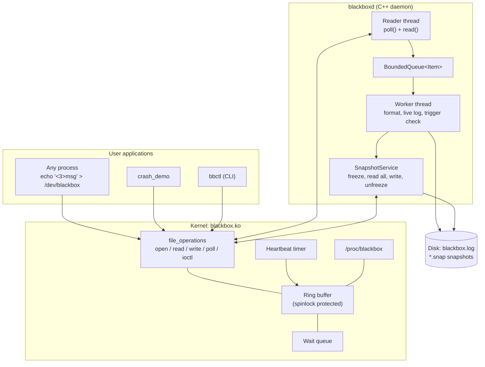
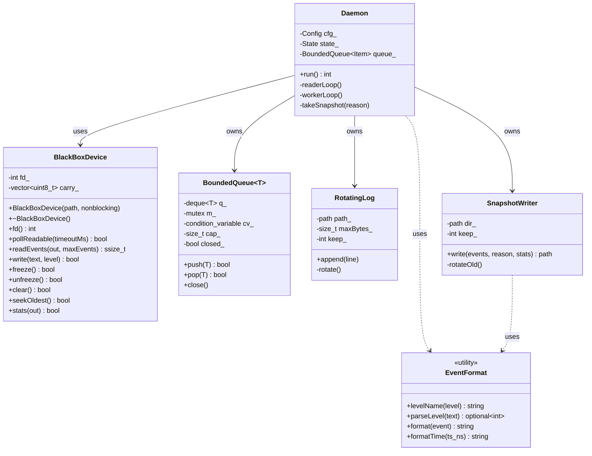
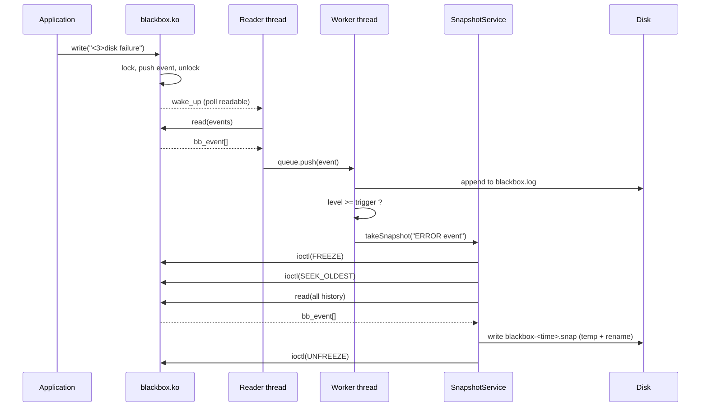
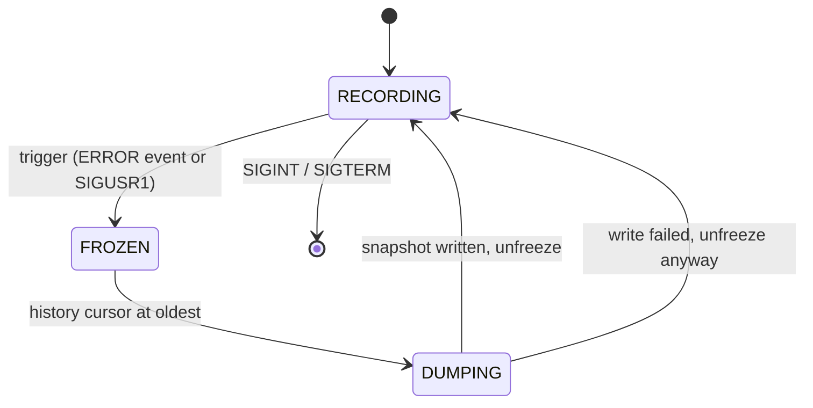
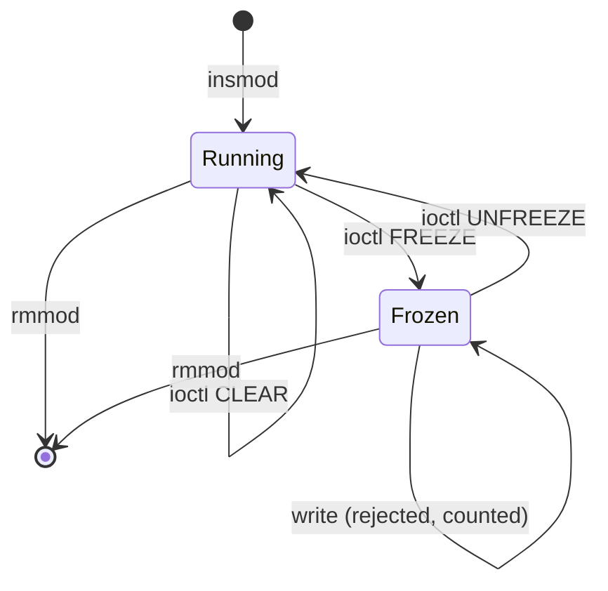

# Stage 3 – System Design and Architecture

## 1. High-level architecture



## 2. Components and responsibilities
| Component | Responsibility |
|---|---|
| `blackbox.ko` | Owns the ring buffer and all synchronisation. Accepts writes, serves reads with per-file cursors, wakes readers, exposes ioctl and procfs. |
| `BlackBoxDevice` | RAII wrapper around the device file descriptor; typed `readEvents`, `ioctl` helpers, `pollReadable`. |
| `EventFormat` | Converts a `bb_event` to a text line; level name ↔ number. |
| `SnapshotWriter` | Writes a snapshot atomically (temp file + rename) and rotates old snapshots. |
| `RotatingLog` | Size-based rotating text log for the live stream. |
| `BoundedQueue<T>` | Thread-safe producer/consumer queue with close semantics. |
| `Daemon` | Orchestrates threads, trigger logic, state machine, signals. |
| `bbctl` | Thin command-line front end for the same device API. |

## 3. Data structures
**Event (128 bytes, shared ABI in `include/bb_uapi.h`)**

| Field | Type | Meaning |
|---|---|---|
| `ts_ns` | u64 | wall-clock time in ns |
| `seq` | u64 | sequence number |
| `pid` | u32 | writer PID |
| `level` | u8 | DEBUG/INFO/WARN/ERROR |
| `source` | u8 | user / heartbeat / driver |
| `len` | u16 | message length |
| `msg` | char[104] | NUL-terminated text |

**Kernel state (`struct bb_dev`)**
```
events[capacity]   array of bb_event (ring)
head_seq           next sequence number to assign
base_seq           events with seq < base_seq are cleared
lock               spinlock (irq-safe: the timer also pushes events)
wq                 wait queue for blocked readers
frozen             1 = reject writes
total_written, dropped_frozen   counters
```
Slot of an event = `seq % capacity`.
Oldest valid sequence = `max(base_seq, head_seq - capacity)`.

**Per-open-file state (`struct bb_session`)**: `next_seq` – the next event this reader will receive.
If a slow reader falls behind the oldest event it silently jumps forward (events were overwritten).

## 4. Locking rules
1. All ring state is protected by one `spinlock_t` taken with `spin_lock_irqsave`.
2. `copy_from_user` / `copy_to_user` are **never** called with the lock held (they may sleep).
3. Writers build the event on the stack first, then lock, push, unlock, then wake readers.
4. Readers copy one event at a time into a stack buffer under the lock, unlock, then copy to user.

## 5. UML diagrams

### 5.1 Class diagram (user space)


### 5.2 Sequence diagram – automatic snapshot on ERROR


### 5.3 State machine – recorder (daemon view)


### 5.4 State machine – kernel ring buffer


## 6. Implementation plan
1. Driver skeleton: register chrdev, class, device; `open/release`.
2. Ring buffer + `write` + `read` (cursor per file).
3. `poll`, ioctl, procfs, heartbeat timer, module parameters.
4. `libbbcommon`: device wrapper, formatter, queue, log, snapshot writer.
5. `blackboxd`: reader/worker threads, trigger, state machine, signals, daemonize.
6. `bbctl` and `crash_demo`.
7. Tests (unit, mock integration, kernel smoke and stress), fixes, documentation.

## 7. Development environment
| Item | Choice |
|---|---|
| OS | Ubuntu 22.04/24.04 in a VM (VirtualBox/VMware/QEMU) |
| Packages | `build-essential linux-headers-$(uname -r) git make valgrind` |
| Compiler | `g++` with `-std=c++17 -Wall -Wextra -pthread` |
| Kernel build | kbuild out-of-tree module (`driver/Makefile`) |
| Debugging | `dmesg -w`, `cat /proc/blackbox`, `valgrind`, `-fsanitize=address,undefined` |

## 8. Git workflow
- `main` – stable, tagged at the end of each stage (`stage-1` … `stage-6`).
- `dev` – integration branch; feature branches `feature/<name>` merge into `dev`.
- Commit messages: `<area>: <what changed>` (e.g. `driver: add poll support`).
- Each stage ends with documentation, a commit and a tag, so progress is visible in history.

## 9. Progress tracking
`docs/PROGRESS.md` records, per stage: what was done, issues found, solutions, and the plan for the next stage.
